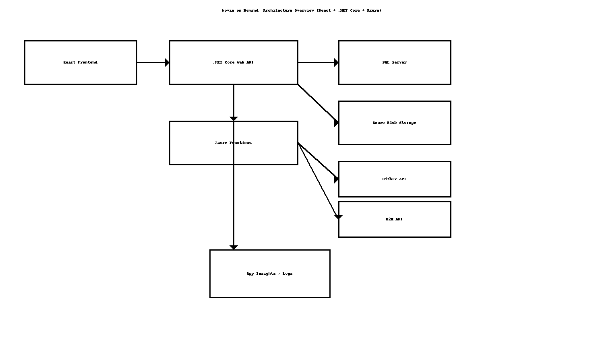
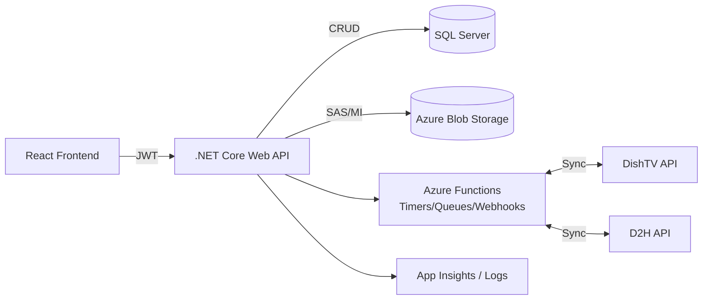

# Movie on Demand – High-Level Design (HLD)

> **Author:** Sagarika Chakraborty — Full Stack .NET Engineer | React.js | Web API | SQL Server

## 1. Overview & Scope
Movie on Demand is a multi-tenant OTT platform enabling:
- **Subscriber management** (registration, login, profile, history, recommendations).
- **Movie & event lifecycle** (create/update/delete, slot scheduling).
- **Slot booking** with conflict prevention and validation.
- **Media storage** in Azure Blob, metadata in SQL Server.
- **Real-time sync** of subscriber/movie/booking data with DishTV and D2H using Azure Functions.
- **RESTful APIs** consumed by a React frontend; JWT-secured.

## 2. Goals & NFRs
- **Security**: JWT auth, RBAC, HTTPS/TLS1.2+, least-privilege access to Blob/SQL, secrets in Key Vault.
- **Reliability**: Idempotent sync jobs, retries/backoff (Polly), outbox pattern for event publishing.
- **Scalability**: Stateless API, horizontal scale; Functions scale on demand; DB indexing/partitioning.
- **Performance**: p95 < 300ms for read endpoints; image fetch via CDN; async processing for writes where possible.
- **Observability**: App Insights traces/metrics, correlation IDs, dashboards for API p95, queue depth, sync lag.
- **Compliance**: PII minimization; encryption in transit & at rest; audit logs for admin and booking actions.

## 3. Architecture

## 4. Components
- **React Frontend**: UI for movies, bookings, subscribers; uploads images to API which writes to Blob.
- **.NET Core Web API**: AuthN/Z (JWT), movie/subscriber/booking services, conflict checks, Blob service, events.
- **Azure Functions**: Processes sync events, schedules periodic recon, handles DishTV/D2H webhooks.
- **SQL Server**: Strongly-typed schemas for Movies, Subscribers, Bookings, Media, Audit.
- **Azure Blob Storage**: Movie posters/images; stored with content-type and cache-control.
- **App Insights**: Centralized telemetry/alerts.

## 5. Data Flow (Happy Path)
1. Admin creates/updates a movie via React → API.
2. API validates input; persists metadata to SQL; uploads image to Blob (SAS/ConnString/Managed Identity).
3. API publishes an **event** to Functions queue.
4. Functions read event, **sync** movie/subscriber/booking changes to DishTV & D2H.
5. Success/failure recorded; retries with backoff; alerts on repeated failures.

## 6. Security
- **JWT** access tokens; refresh tokens; RBAC roles (`Subscriber`, `Admin`, `Ops`).
- **Input validation** at API; size limits on images; virus scan hook (optional).
- **Blob access** via Managed Identity or SAS with short TTL.
- **SQL**: parameterized queries/EF; row-level authorization for subscriber reads.
- **Audit logging** for movie CRUD and booking state transitions.

## 7. Availability & DR
- API & Functions in multi-AZ; SQL backups & PITR; Blob RA-GRS optional.
- Health probes; autoscale; circuit breaker for external APIs.
- Incident runbooks, SLOs, and error budgets documented.

## 8. CI/CD
- Build → test → package to **Artifacts**.
- Infra as Code (Bicep/ARM/Terraform optional).
- Release with approvals; blue/green/canary supported.
- Post-deploy smoke tests and telemetry gates.

## 9. Assumptions
- DishTV/D2H provide REST endpoints with appropriate auth & quotas.
- Movie images are JPEG/PNG under 2–5MB typical size.
- CDN fronting Blob can be added for scale.
