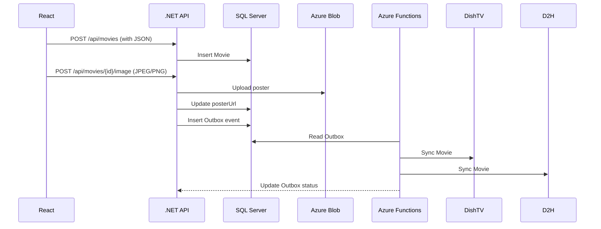

# Movie on Demand – Low-Level Design (LLD)

> **Author:** Sagarika Chakraborty — Full Stack .NET Engineer | React.js | Web API | SQL Server

## 1. Solution Layout
- **src/MovieOnDemand.Api** — ASP.NET Core Web API (Controllers, DI, Middleware, DTOs)
- **src/MovieOnDemand.Core** — Domain models, Services, Validators, Policies (Polly), Interfaces
- **src/MovieOnDemand.Infrastructure** — EF Core/Dapper Repositories, Blob Client, Outbox, Key Vault
- **jobs/MovieOnDemand.Functions** — Azure Functions (Timer/Queue/Webhook) for DishTV/D2H sync
- **tests/** — Unit/Integration/Contract tests

## 2. Core Endpoints (sample)
### Auth
- `POST /api/auth/login` → `{ email, password }` → 200 `{ accessToken, refreshToken }`
- `POST /api/auth/refresh` → `{ refreshToken }`

### Movies
- `POST /api/movies` (Admin) — create movie
- `GET /api/movies/{id}` — get movie by id
- `PUT /api/movies/{id}` (Admin) — update
- `DELETE /api/movies/{id}` (Admin) — soft delete
- `GET /api/movies?search=&genre=&page=&size=` — list/filter
- `POST /api/movies/{id}/image` (Admin) — upload poster → Blob

### Subscribers
- `POST /api/subscribers` — register
- `GET /api/subscribers/{id}` (Owner/Admin) — profile incl. status/history
- `PUT /api/subscribers/{id}` (Owner/Admin) — update
- `GET /api/subscribers/{id}/recommendations` — list

### Bookings
- `POST /api/bookings` — body `{ subscriberId, movieId, slotStart, slotEnd }` → **conflict check**
- `GET /api/bookings/{id}`
- `GET /api/bookings?subscriberId=&movieId=&from=&to=`
- `DELETE /api/bookings/{id}` — cancel

### Sync (Ops)
- `POST /api/sync/trigger` — on-demand full/partial reconcile
- **Functions**: `DishTvWebhook`, `D2hWebhook`, `SyncTimer`, `OutboxProcessor`

## 3. DTOs (examples)
```json
// MovieCreateRequest
{
  "title": "Inception",
  "genre": "Sci-Fi",
  "durationMinutes": 148,
  "releaseYear": 2010,
  "description": "A thief who steals corporate secrets through dream-sharing tech..."
}

// BookingRequest
{
  "subscriberId": "guid",
  "movieId": "guid",
  "slotStart": "2025-10-05T18:00:00Z",
  "slotEnd": "2025-10-05T20:45:00Z"
}
```

## 4. Validation
- `title` not empty; `genre` from allow-list; `durationMinutes` 1–600; `releaseYear` reasonable range.
- Booking: `slotStart < slotEnd`; **no overlap** for same subscriber/movie; honor capacity limits.
- Image upload: content-type `image/jpeg|png`, max 5MB; generate normalized filename; store content-type and cache headers.

## 5. Persistence (ER Overview)
**Tables:**
- `Movies(id, title, genre, durationMinutes, releaseYear, description, posterUrl, status, createdAt, updatedAt)`
- `Subscribers(id, email, hash, name, status, createdAt, updatedAt)`
- `Bookings(id, subscriberId, movieId, slotStart, slotEnd, status, createdAt)`
- `Outbox(id, aggregateId, type, payloadJson, status, createdAt)`
- `Audit(id, actorId, entity, entityId, action, beforeJson, afterJson, at)`
Indexes: `Movies(title)`, `Subscribers(email) unique`, `Bookings(subscriberId, slotStart)`, `Bookings(movieId, slotStart)`.

## 6. Blob Storage
- Container: `movie-images`
- Key format: `movies/{movieId}/poster_{yyyyMMddHHmmss}.jpg`
- Access: Managed Identity or SAS; set `ContentType`, `Cache-Control` (`public, max-age=86400`).

## 7. Sequences


## 8. Error Handling
- `400` validation; field map with reasons
- `401/403` JWT/RBAC
- `404` not found
- `409` booking conflict
- `413` payload too large (image)
- `5xx` upstream sync errors → retry with backoff; circuit breaker

## 9. Observability
- Correlation IDs; structured logs (Serilog).
- App Insights traces/metrics; custom events (`MovieCreated`, `BookingConflict`, `SyncFailed`).
- Dashboards: API p95/99, queue depth, sync success rate, error budget.

## 10. Test Strategy
- **Unit**: validators, services, conflict/reservation engine.
- **Integration**: controllers + repo + SQL testcontainer; Blob client mock.
- **Contract**: DishTV/D2H stubs (WireMock).
- **Load**: k6/Locust for `/movies` and `/bookings`.
- **Security**: JWT tampering, RBAC, image upload constraints.

## 11. Deployment & Runbooks
- Blue/green slots; rollback via previous artifact.
- Rotate Blob/SQL creds (or MI) every 90 days; Key Vault for secrets.
- Runbooks: stuck outbox handler, sync API outage, DB hot partitions, Blob 429s.
